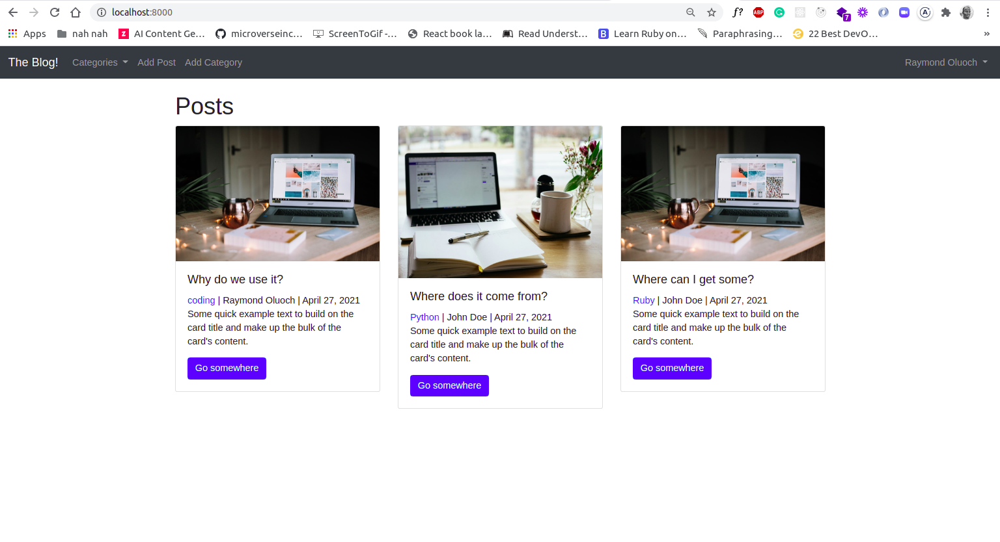

# The Django Blog [Live Link](#)

- Python
- Django
- Bootstrap



## Usage
> Clone the repository to your local machine using ssh:
```
$ git clone git@github.com:rOluochKe/the_django_blog.git
```
> cd into the directory
```
$ cd the_django_blog/blog
```
> Run migrations
```
$ cd python3 manage.py makemigrations theblog
$ cd python3 manage.py makemigrations members

$ cd python3 manage.py migrate theblog
$ cd python3 manage.py migrate members

$ cd python3 manage.py migrate
```
> Run the app locally
```
$ python3 manage.py runserver
```
> View the app on the browser on port
```
$ http://localhost:8000
```

## Functionalities
- View all blog posts
- View a single blog post
- Comment on a blog post
- Like a blog post
- Register account
- Login to account
- Logout of account
- Reset password
- Update account profile
- View profile
- Hosted on Heroku

## Designed and developed by
- [Raymond Oluoch](https://github.com/rOluochKe)